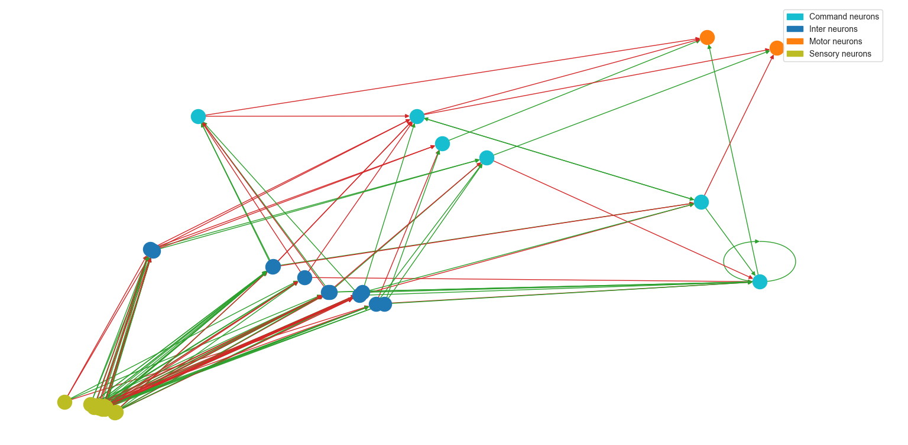
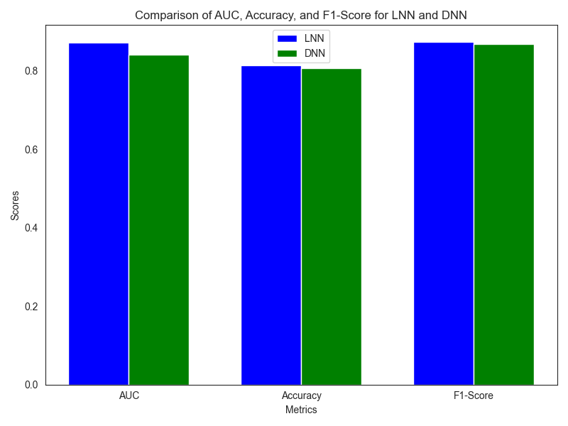
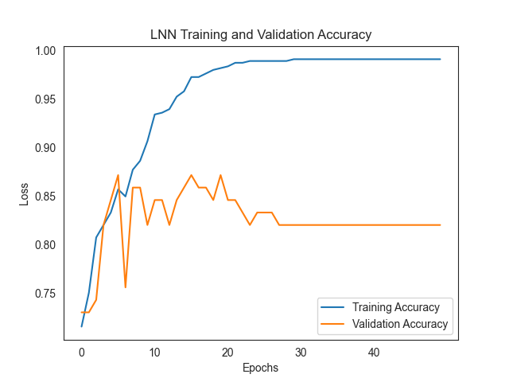
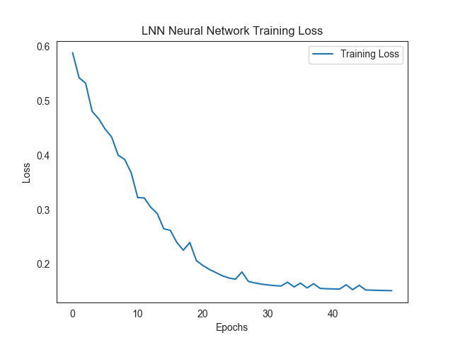
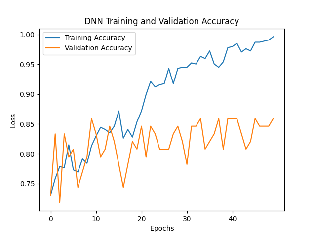
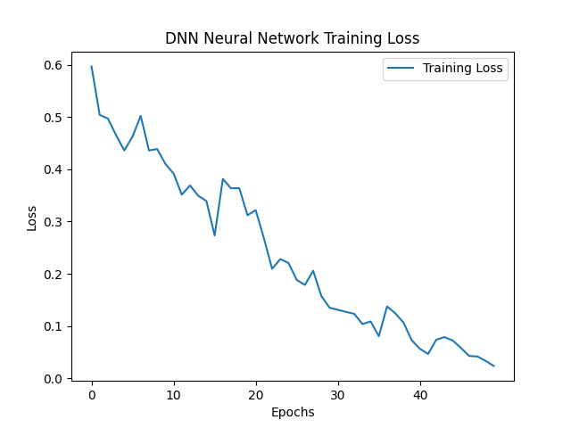
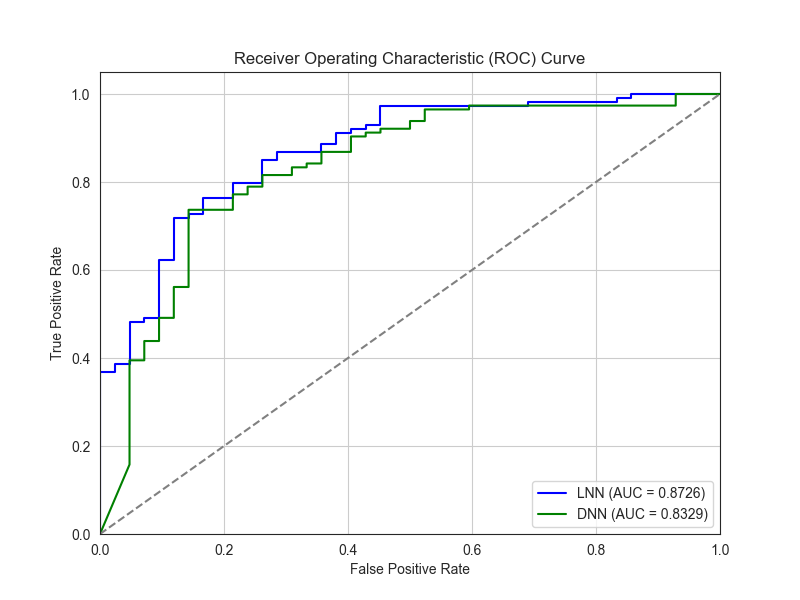
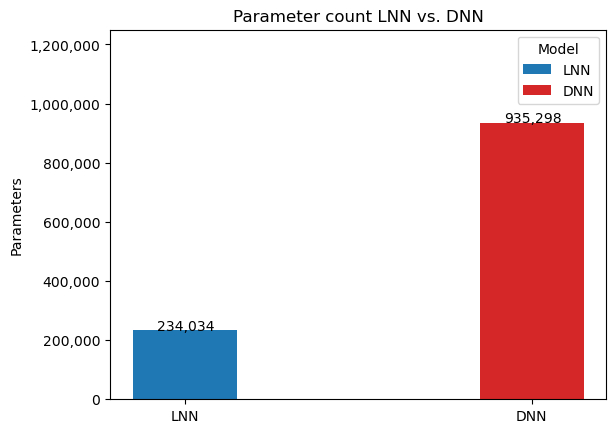

# Liquid Neural Networks for Cancer Classification

This project aims to use **Liquid Neural Network (LNN)** architecture to classify breast cancer ultrasounds from the [MedMNIST dataset](https://medmnist.com/).

### Background
Liquid Time-constant Networks (LTC), first introduced by Ramin Hasani et al., allow networks to exhibit variable non-linear relationships rather than fixed non-linearities. Learn more [here](https://doi.org/10.1609/aaai.v35i9.16936).  
These LTC cells were later applied within a Neural Circuit Policy (NCP) architecture, inspired by the brain of the C. elegans worm. Learn more about this application [here](https://www.nature.com/articles/s41597-022-01721-8).

The MedMNIST v2 dataset is an open-source dataset of medical images for various tasks. For this project, the **BreastMNIST** subset was used to classify breast ultrasound images as either benign/normal (positive) or malignant (negative).

### Network Architecture
The detection pipeline begins by passing images through a convolutional layer. The output is then processed by a 19-neuron **NCP**. Below is the wiring diagram of the NCP, illustrating the various neuron types and recurrent connections:



LNNs have the advantage of sparsity compared to other architectures, which is highlighted in the comparison of the number of parameters later in this document.

### Training
The **LNN** model was trained for 50 epochs with a batch size of 128. We used cross-entropy loss and the **Adam** optimizer with a learning rate of 0.001. The dataset was split into training, validation, and testing sets with a ratio of 7:1:2. Validation accuracy was evaluated after each epoch.

The **Deep Neural Network (DNN)** model used for comparison was trained with the same hyperparameters and data splits.

### Model Usage
To get started, follow these steps:

1. Clone this repository:

    ```bash
    git clone https://github.com/yourusername/cancer-classification-lnn-dnn.git
    cd cancer-classification-lnn-dnn
    ```

2. First, run the **models.py** script to define and build the models:

    ```bash
    python models.py
    ```

3. Once the models are built, train the models by running the training script:

    ```bash
    python train.py
    ```

Within the `train.py` file, you can adjust the flags to switch between models, save/load models, and adjust settings. The best-trained LNN model is stored at:

```saved_models/LNN_SAVE_898590```

### File Overview

- **`bar_charts.py`**: This script generates bar charts to compare model performance across different metrics such as AUC, Accuracy, and F1-Score.
  
  

- **`comparing.py`**: This script contains the logic to compare the performance of the Liquid Neural Network (LNN) against a traditional Deep Neural Network (DNN) using various evaluation metrics.

- **`models.py`**: This script defines and builds the LNN and DNN models used in the project.

- **`train.py`**: The main training script for both the LNN and DNN models. You can adjust hyperparameters, choose models, and load/save models within this script.

### Results
Below are the training loss, training accuracy, and validation accuracy plots for the LNN and DNN models. The LNN model shows better stability and faster convergence than the DNN model.

#### **LNN Model:**

- **Training and Validation Accuracy:**
  
  
- **Training Loss:**
  
  

#### **DNN Model:**

- **Training and Validation Accuracy:**
  

- **Training Loss:**
  
  

### Model Performance

After training, the LNN model was tested on the testing dataset and achieved the following metrics:

- **Area Under the Curve (AUC): 0.8726**
- **Accuracy (ACC): 0.842**
- **F1-Score: 0.897**

For comparison, the DNN model achieved the following:

- **AUC: 0.8329**
- **Accuracy (ACC): 0.815**
- **F1-Score: 0.865**

#### ROC Curves:
The following ROC curves demonstrate the difference in performance between the LNN and DNN models, with the LNN having a slightly better AUC.



### Parameter Comparison
One of the key advantages of Liquid Neural Networks is their relative sparsity. Despite having **120% fewer parameters** than the DNN, the LNN performs better on all evaluation metrics.

Below is the comparison of the model parameters, showing the compact nature of LNNs:



### Conclusion
Liquid Neural Networks outperform traditional Deep Neural Networks in this breast cancer image classification task. Despite the smaller model size, the LNN demonstrates higher accuracy, AUC, and F1-scores, along with faster convergence during training.

LNN's sparsity, coupled with its performance, makes it a promising candidate for medical image classification tasks, where model interpretability and efficiency are critical.
